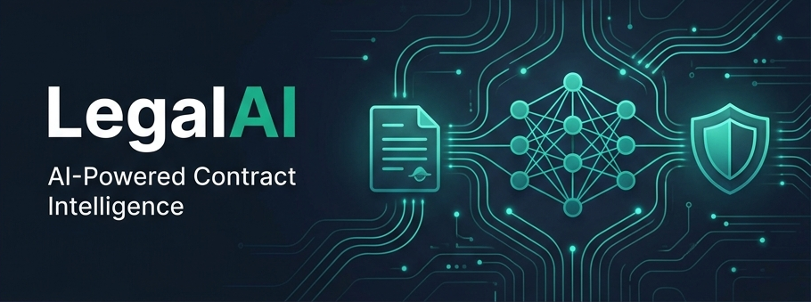
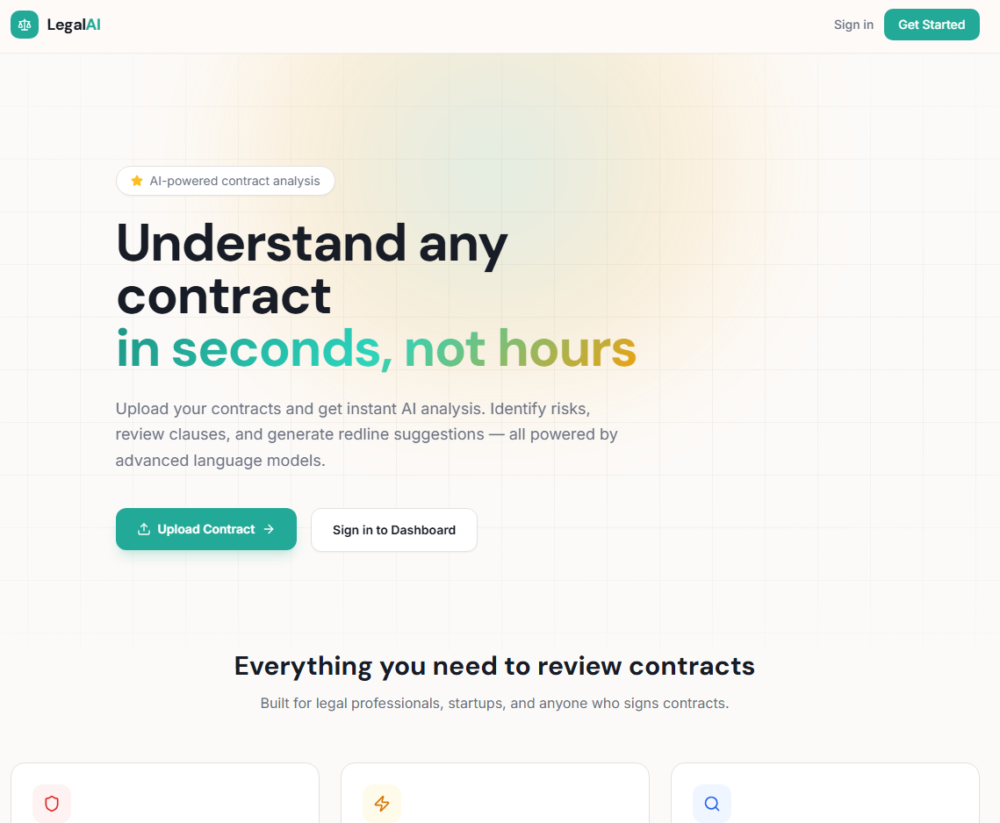
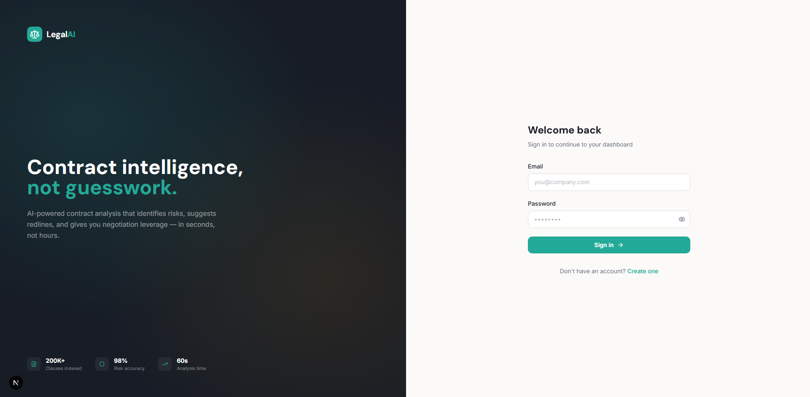
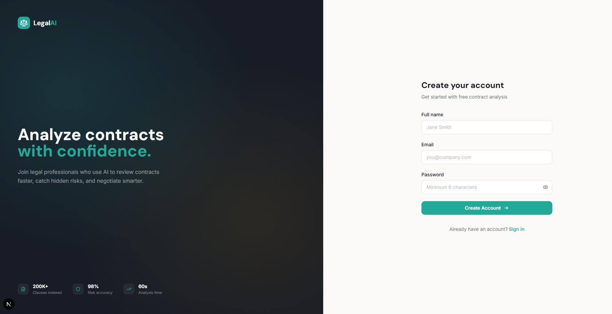
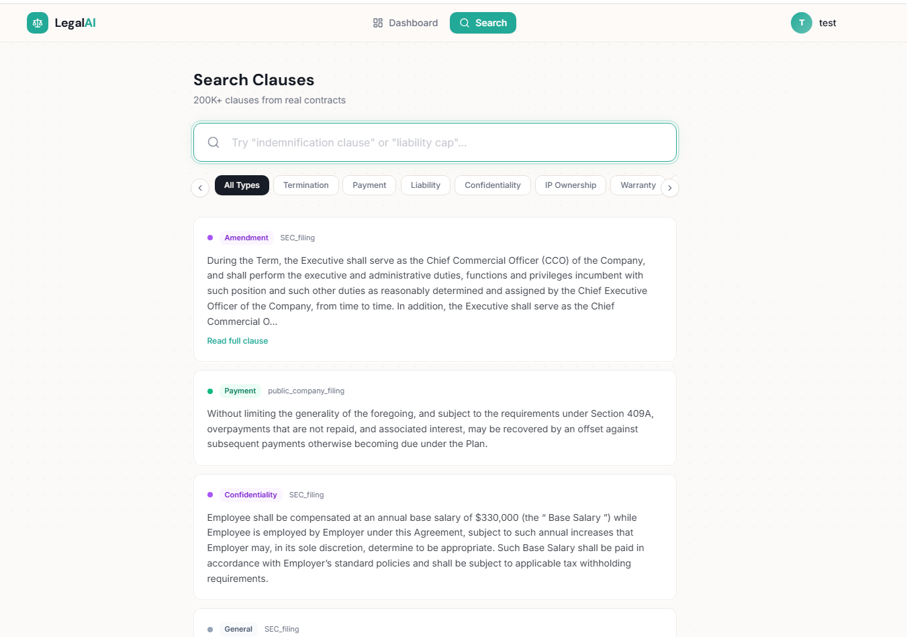
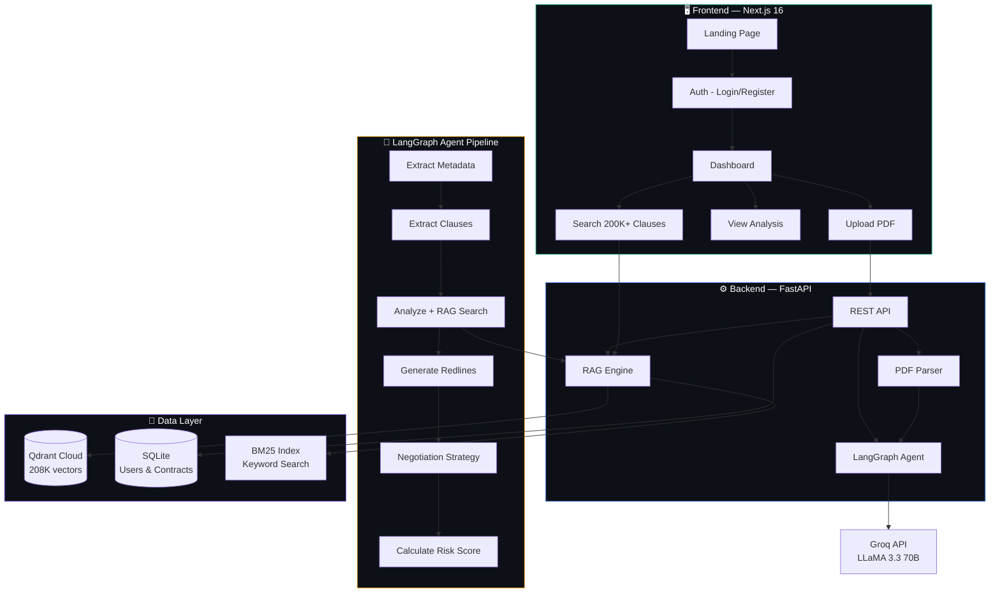
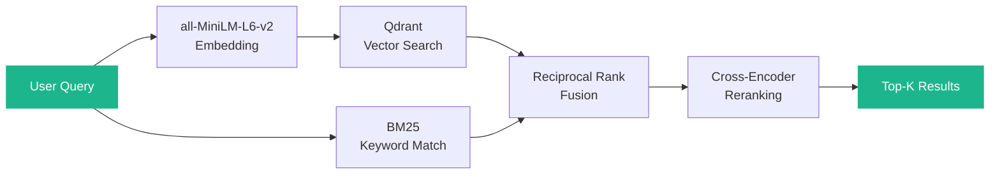
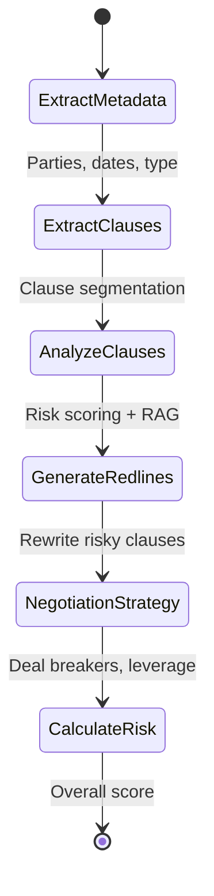

<p align="center">
  
</p>

<p align="center">
  <strong>AI-Powered Contract Intelligence Platform</strong><br/>
  Upload any contract. Get instant risk analysis, clause-by-clause review, redline suggestions, and negotiation strategy — in seconds.
</p>

<p align="center">
  
  
  
  
  
  
</p>

---

## 🎯 What is LegalAI?

LegalAI is a **full-stack AI contract analysis platform** that combines a **multi-step LangGraph agent**, a **hybrid RAG pipeline** (BM25 + semantic search + cross-encoder reranking), and **200K+ real legal clauses** to deliver production-grade contract intelligence.

Upload a PDF contract and the system will:

1. **Extract** metadata, parties, dates, and contract type
2. **Identify** every clause and classify it (liability, termination, payment, etc.)
3. **Score risk** (1-10) for each clause using LLM reasoning + market comparison
4. **Generate redlines** — rewritten versions of high-risk clauses
5. **Build negotiation strategy** — priority issues, deal breakers, talking points
6. **Search 200K+ clauses** — find similar language from real SEC filings and public contracts

---

## ✨ Key Features

- 🔎 **Clause-Level Risk Scoring** — Every clause individually scored 1–10 with LLM-generated explanations
- 📝 **Automated Redlining** — High-risk clauses (≥7) automatically rewritten with balanced alternatives
- 🤝 **Negotiation Strategy** — AI generates priority issues, deal breakers, compromise positions, and email openers
- 🔍 **Semantic Clause Search** — Search 208K+ real clauses using hybrid retrieval (BM25 + vector + reranking)
- 📊 **Market Comparison** — Each clause compared against similar language from SEC filings and public contracts
- 🏷️ **Auto-Classification** — 10+ clause types automatically detected (liability, termination, payment, NDA, etc.)
- 📄 **PDF Processing** — Dual-engine extraction (PDFPlumber + PyMuPDF) handles complex document layouts
- 🔐 **Secure Auth** — JWT-based authentication with bcrypt password hashing and session persistence
- 📱 **Responsive UI** — Modern "Legal Dark" design system built with Next.js 16 + Tailwind CSS

---

## 📦 Dataset

**208,990 legal clause vectors** indexed in Qdrant, sourced from:

| Source | Type | Description |
|---|---|---|
| **SEC EDGAR** | Public filings | Real contracts from 10-K, 10-Q, 8-K filings |
| **LawInsider** | Clause templates | Curated clause samples across contract types |
| **Creative Commons** | Open licenses | CC-licensed legal documents and agreements |
| **Synthetic** | Generated | LLM-augmented clause variants for underrepresented types |

### Clause Type Distribution

| Clause Type | Description |
|---|---|
| `liability` | Limitation of liability, damages caps |
| `termination` | Exit clauses, notice periods |
| `payment` | Fees, billing terms, late penalties |
| `confidentiality` | NDA provisions, information handling |
| `indemnification` | Hold harmless, defense obligations |
| `warranty` | Guarantees, disclaimers, AS-IS provisions |
| `ip_ownership` | Intellectual property rights, licensing |
| `governing_law` | Jurisdiction, dispute resolution |
| `force_majeure` | Unforeseeable events, pandemic clauses |
| `non_compete` | Restrictive covenants, non-solicitation |
| `general` | Catch-all for miscellaneous provisions |

---

## 🎯 Use Cases

| User | How They Use LegalAI |
|---|---|
| **Startup Founders** | Review SaaS agreements, vendor contracts, and NDAs before signing |
| **Legal Professionals** | Speed up first-pass contract review and focus on high-risk clauses |
| **Procurement Teams** | Compare clause language against market standards |
| **Students & Researchers** | Explore real contract language across 200K+ clauses |

---

## 📸 Screenshots

<details open>
<summary><strong>Landing Page</strong></summary>
<br/>

</details>

<details>
<summary><strong>Sign In</strong></summary>
<br/>

</details>

<details>
<summary><strong>Sign Up</strong></summary>
<br/>

</details>

<details open>
<summary><strong>Dashboard</strong></summary>
<br/>

</details>

<details open>
<summary><strong>Contract Analysis</strong></summary>
<br/>

</details>

<details>
<summary><strong>Clause Search (200K+ clauses)</strong></summary>
<br/>

</details>

---

## 🏗️ System Architecture



---

## 🔍 RAG Pipeline — Deep Dive

The search engine uses a **3-stage hybrid retrieval** architecture:



| Stage | Component | Purpose |
|---|---|---|
| **Embedding** | `all-MiniLM-L6-v2` | Dense semantic encoding (384 dims) |
| **Vector Search** | Qdrant Cloud | Cosine similarity over 208K vectors |
| **Keyword Search** | BM25 (Okapi) | Exact term matching for legal jargon |
| **Fusion** | Reciprocal Rank Fusion | Combines dense + sparse rankings |
| **Reranking** | Cross-Encoder | Fine-grained relevance scoring |

### Evaluation Results

| Metric | Score | Target | Status |
|---|---|---|---|
| Mean Reciprocal Rank (MRR) | **0.9571** | ≥ 0.70 | ✅ PASS |
| Hit Rate@5 | **95.0%** | ≥ 80% | ✅ PASS |
| Hit Rate@10 | **100.0%** | ≥ 90% | ✅ PASS |
| Classification Accuracy | **90.0%** | ≥ 85% | ✅ PASS |
| Total Indexed Vectors | **208,990** | ≥ 100K | ✅ PASS |

> Evaluated on 20 test queries across 10 clause types. Full report: [`data/evaluation_report.md`](data/evaluation_report.md)

---

## 🤖 LangGraph Agent Pipeline

Each contract passes through a **6-node directed graph** built with LangGraph:



| Node | What it does | LLM Calls |
|---|---|---|
| `extract_metadata` | Identifies contract type, parties, key dates, summary | 1 |
| `extract_clauses` | Segments full text into individual clauses with type labels | 1 |
| `analyze_clauses` | Scores each clause (1-10) + RAG search for market comparison | N (parallel) |
| `generate_redlines` | Rewrites high-risk clauses (score ≥ 7) with balanced alternatives | 1 per risky clause |
| `generate_strategy` | Creates negotiation playbook with talking points | 1 |
| `calculate_risk` | Computes weighted average across all clauses | 0 (pure compute) |

---

## 🛠️ Tech Stack

### Backend
| Technology | Role |
|---|---|
| **FastAPI** | Async REST API framework |
| **LangGraph** | Multi-step agent orchestration |
| **Groq (LLaMA 3.3 70B)** | LLM inference at ~800 tok/s |
| **Qdrant Cloud** | Vector database (208K+ vectors) |
| **Sentence-Transformers** | `all-MiniLM-L6-v2` embeddings |
| **BM25 (rank-bm25)** | Sparse keyword retrieval |
| **SQLAlchemy (async)** | SQLite ORM for users & contracts |
| **PDFPlumber + PyMuPDF** | Dual-engine PDF text extraction |
| **bcrypt + python-jose** | JWT auth with password hashing |

### Frontend
| Technology | Role |
|---|---|
| **Next.js 16** | React framework (Turbopack) |
| **TypeScript** | Type-safe UI development |
| **Tailwind CSS** | Utility-first styling |
| **Radix UI** | Accessible component primitives |
| **Zustand** | Lightweight state management with persistence |
| **Lucide React** | Icon system |
| **Sonner** | Toast notifications |
| **react-dropzone** | Drag-and-drop file upload |

### Data Pipeline
| Script | Purpose |
|---|---|
| `1_scrape_lawinsider.py` | Scrape LawInsider for clause templates |
| `2_scrape_sec_edgar.py` | Scrape SEC EDGAR for real contract filings |
| `3_scrape_creative_commons.py` | Scrape Creative Commons licensed contracts |
| `4_parse_and_extract.py` | Parse PDFs and extract clauses |
| `5_generate_synthetic.py` | Generate synthetic clause variants |
| `6_embed_and_index.py` | Embed clauses and index in Qdrant |
| `7_build_bm25_index.py` | Build BM25 sparse index |
| `8_labeling_app.py` | Streamlit app for clause type labeling |
| `evaluate.py` | Full evaluation suite (MRR, Hit Rate, Classification) |

---

## 📁 Project Structure

```
Legal AI/
├── backend/
│   ├── app/
│   │   ├── api/
│   │   │   ├── routes/
│   │   │   │   ├── auth.py           # Login, register, JWT
│   │   │   │   ├── contracts.py      # Upload, list, delete, view
│   │   │   │   └── search.py         # Semantic + keyword clause search
│   │   │   └── deps.py              # Auth dependency injection
│   │   ├── core/
│   │   │   ├── config.py            # Pydantic settings (.env)
│   │   │   ├── database.py          # SQLAlchemy async engine
│   │   │   └── security.py          # bcrypt + JWT utilities
│   │   ├── models/
│   │   │   ├── user.py              # User ORM model
│   │   │   └── contract.py          # Contract ORM (JSON clauses)
│   │   ├── schemas/                  # Pydantic request/response models
│   │   ├── services/
│   │   │   ├── agent/
│   │   │   │   ├── graph.py          # LangGraph state machine
│   │   │   │   ├── nodes.py          # 6 processing nodes
│   │   │   │   ├── state.py          # TypedDict agent state
│   │   │   │   └── tools.py          # Groq LLM tool calls
│   │   │   ├── pdf_parser.py         # Dual-engine PDF extraction
│   │   │   └── rag_engine.py         # Hybrid RAG (BM25 + vectors)
│   │   └── main.py                   # FastAPI app entry point
│   ├── .env.example                  # Environment template
│   └── requirements.txt
│
├── frontend/
│   ├── app/
│   │   ├── page.tsx                  # Landing page
│   │   ├── login/page.tsx            # Auth — login
│   │   ├── register/page.tsx         # Auth — register
│   │   ├── dashboard/
│   │   │   ├── layout.tsx            # Protected layout + nav
│   │   │   └── page.tsx              # Dashboard with stats & contracts
│   │   ├── analyze/[id]/page.tsx     # Contract analysis view
│   │   └── search/page.tsx           # 200K+ clause search
│   ├── components/
│   │   ├── analysis/                 # ClauseCard, RiskBadge, etc.
│   │   ├── shared/                   # ContractTable, Skeleton, etc.
│   │   └── upload/                   # FileUpload dropzone
│   ├── lib/
│   │   ├── api.ts                    # Typed API client
│   │   ├── store.ts                  # Zustand auth + cache store
│   │   └── utils.ts                  # Helpers
│   └── types/index.ts                # Shared TypeScript interfaces
│
├── data/
│   └── scripts/                      # Data pipeline (scraping → indexing)
│       ├── 1_scrape_lawinsider.py
│       ├── ...
│       └── evaluate.py               # RAG evaluation suite
│
└── docs/
    ├── banner.png
    └── screenshots/
```

---

## 🚀 Getting Started

### Prerequisites

- Python 3.13+
- Node.js 20+
- Qdrant Cloud account (free tier works)
- Groq API key (free tier)

### 1. Clone the repository

```bash
git clone https://github.com/YOUR_USERNAME/legalai.git
cd legalai
```

### 2. Backend setup

```bash
cd backend
python -m venv venv

# Windows
.\venv\Scripts\activate

# macOS/Linux
source venv/bin/activate

pip install -r requirements.txt
```

Create `.env` from the template:

```bash
cp .env.example .env
```

Fill in your keys:

```env
DATABASE_URL=sqlite+aiosqlite:///./legalai.db
SECRET_KEY=your-secret-key-here
ALGORITHM=HS256
ACCESS_TOKEN_EXPIRE_MINUTES=1440
GROQ_API_KEY=gsk_your_groq_key
QDRANT_URL=https://your-cluster.qdrant.io
QDRANT_API_KEY=your_qdrant_key
QDRANT_COLLECTION=legal_clauses
```

Start the server:

```bash
python -m uvicorn app.main:app --reload
```

### 3. Frontend setup

```bash
cd frontend
npm install
npm run dev
```

Open [http://localhost:3000](http://localhost:3000) and you're ready to go.

---

## 📊 API Endpoints

| Method | Endpoint | Description |
|---|---|---|
| `POST` | `/api/auth/register` | Create account (returns JWT + user) |
| `POST` | `/api/auth/login` | Login (returns JWT + user) |
| `GET` | `/api/auth/me` | Get current user profile |
| `POST` | `/api/contracts/upload` | Upload PDF → starts background analysis |
| `GET` | `/api/contracts/` | List all user contracts |
| `GET` | `/api/contracts/{id}` | Get full analysis results |
| `DELETE` | `/api/contracts/{id}` | Delete a contract |
| `POST` | `/api/search/clauses` | Semantic clause search |
| `GET` | `/api/search/browse` | Browse clauses by type |

---

## 📄 License

This project is for educational and portfolio purposes.

---

<p align="center">
  <strong>LegalAI</strong> — Contract intelligence, not guesswork.
</p>
